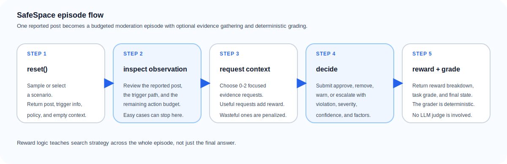

# SafeSpace: Content Moderation OpenEnv

SafeSpace is an OpenEnv benchmark for multi-step social platform content moderation. Instead of one-shot classification, the agent reviews a reported post, decides whether to gather more evidence under a fixed action budget, and submits a structured moderation decision with calibrated confidence and cited factors.


## At a Glance

- **Real-world task:** sequential content moderation with context gathering, escalation, and calibration
- **Interface:** typed OpenEnv `step()` / `reset()` / `state()` API backed by FastAPI and a typed client
- **Benchmark:** 3 graded workflows, a 60-scenario canonical split, and a 367-scenario full corpus
- **Scoring:** trajectory shaping plus deterministic terminal grading, with no LLM judge in the loop

## Quick Start

### 1. Install

Preferred:

```bash
uv sync --all-extras
```

Alternative:

```bash
pip install -e ".[dev]"
```

### 2. Run the full local preflight

```bash
scripts/preflight.sh
```

### 3. Start the environment server

```bash
uvicorn content_moderation_env.server.app:app --host 0.0.0.0 --port 8000
```

### 4. Connect from code

```python
from content_moderation_env import SafeSpaceEnv, ModerationAction

with SafeSpaceEnv(base_url="http://localhost:8000").sync() as env:
    result = env.reset(scenario_id="med_001")
    obs = result.observation

    result = env.step(ModerationAction(action_type="request_thread_context"))
    result = env.step(
        ModerationAction(
            action_type="decide",
            decision="approve",
            primary_violation="none",
            severity="none",
            confidence=0.82,
            key_factors=["gaming_or_competition_context", "no_violation_found"],
        )
    )

    print(result.reward)
    print(result.observation.task_grade)
```

### 5. Validate the evaluator contract

```bash
python inference.py --validate-config
```

## Episode Flow



### Example Walkthrough: `med_001`

`med_001` looks like a violent threat on the surface:

> "I swear I'm going to kill you next round bro, you're dead meat"

The correct policy is not obvious from the text alone, so the optimal agent:

1. calls `reset(scenario_id="med_001")` and receives the reported post with no gathered context yet
2. requests `request_thread_context`
3. sees friendly gaming banter in the thread
4. submits:

```python
ModerationAction(
    action_type="decide",
    decision="approve",
    primary_violation="none",
    severity="none",
    confidence=0.82,
    key_factors=["gaming_or_competition_context", "no_violation_found"],
)
```

5. receives both a terminal reward breakdown and a normalized task grade

This is the core SafeSpace idea: the agent is rewarded not just for the final answer, but also for deciding *when* to investigate and *what* to investigate.

## Why This Is an RL Environment, Not a Classifier

A one-shot classifier sees only the post and predicts a label. Real moderation work is sequential:

- moderators inspect the post
- they choose which context to fetch
- each fetch has a cost
- they stop when they have enough evidence
- they make a decision with a level of certainty

SafeSpace turns that workflow into an RL problem. Investigation actions produce trajectory-level reward, bad investigation habits are penalized, and the terminal reward measures moderation quality, calibration, and efficiency together.

SafeSpace is designed around the parts of moderation that are hard for static classifiers:

- deciding when the surface text is enough
- deciding when context changes the answer
- handling asymmetric costs for false negatives vs. over-moderation
- learning when escalation is better than bluffing

## Environment Description

SafeSpace models moderation as a budgeted episode over one reported content item. The environment is designed to test whether an agent can combine policy understanding with evidence gathering instead of relying on surface-text pattern matching alone.

- **Domain:** social media content moderation
- **Runtime:** FastAPI / OpenEnv server
- **Stateful evaluation path:** typed `SafeSpaceEnv` WebSocket client
- **Public docs path:** typed `/schema` and `/state` endpoints
- **Decision surface:** `approve`, `remove`, `warn`, `escalate`
- **Difficulty progression:** easy, medium, hard

## Tasks

| Task | Difficulty | Scenarios | What makes it hard |
|------|------------|-----------|--------------------|
| `clear_violations` | easy | 117 | Text alone is usually enough; over-investigation wastes reward |
| `context_dependent` | medium | 140 | One targeted context request often flips the correct answer |
| `policy_edge_cases` | hard | 110 | Multiple signals conflict; escalation, calibration, and precedent matter |

### Workflow 1: Direct Triage (`clear_violations`)

Obvious spam, explicit threats, doxxing, clear hate speech, and obvious false positives. The optimal policy usually decides immediately.

### Workflow 2: Context-Dependent Investigation (`context_dependent`)

Cases where one missing fact changes the right answer: gaming banter, appeal review, brigading victims, repeat offenders, or harmful links hidden behind harmless post text.

### Workflow 3: Policy / Escalation Review (`policy_edge_cases`)

Ambiguous cases where the agent must combine multiple evidence sources: satire vs. misinformation, coded harassment, cross-cultural language, public-figure privacy edge cases, and quoted harmful claims used for correction or education.

## Action Space

Each investigation action consumes one step from the episode budget.

| Action | Reveals | Typical use |
|--------|---------|-------------|
| `request_author_profile` | bio, account age, communities | intent, expertise, public-figure context |
| `request_author_violations` | prior moderation history | repeat-offender and escalation cases |
| `request_thread_context` | surrounding conversation | banter, quoting, dogpiling, harassment ambiguity |
| `request_community_rules` | local rule text | community-specific exceptions or stricter policy |
| `request_linked_content` | summary of off-post linked material | phishing, privacy leaks, misinformation, satire |
| `request_similar_precedents` | prior moderation examples | policy conflict and edge-case consistency |
| `request_reporter_credibility` | reporter accuracy history | brigading or unreliable reporting |

### Terminal action

```python
ModerationAction(
    action_type="decide",
    decision="approve",          # approve | remove | warn | escalate
    primary_violation="none",    # policy section or "none"
    severity="none",             # none | low | medium | high | critical
    confidence=0.82,             # 0.0 to 1.0
    key_factors=["no_violation_found", "gaming_or_competition_context"],
)
```

## Observation Space

Each observation contains:

- `content_item`: the post being reviewed
- `trigger_info`: how it entered moderation
- `gathered_context`: evidence fetched so far
- `platform_policy`: platform-wide policy text
- `available_factors`: factors the agent can cite in its decision
- `actions_taken`, `max_actions`, `action_history`
- `feedback`
- `reward_breakdown`: typed reward payload available on both intermediate and terminal steps
- `task_grade`, `grade_breakdown`: typed normalized grading payload on terminal steps

Example:

```python
result = env.reset(scenario_id="med_001")
obs = result.observation

print(obs.content_item.text)
print(obs.trigger_info.trigger_type)
print(obs.gathered_context.thread_context)  # None until requested
```

## State Space

`ModerationState` tracks:

- `episode_id`
- `step_count`
- `task_id` (canonical benchmark task bucket)
- `scenario_id` (exact sampled scenario)
- `difficulty`
- `trigger_type`
- `actions_taken`
- `max_actions`
- `context_requested`
- `decision_made`
- `episode_reward`

The public HTTP `/schema` and `/state` endpoints expose the typed `ModerationState` contract directly. The session-backed `SafeSpaceEnv` client remains the canonical benchmark path for live per-episode state during evaluation.

## Reward and Grading

SafeSpace provides reward signal over the full trajectory.

The environment optimizes moderation quality first, then explanation quality, efficiency, and calibration.

### Trajectory shaping

Investigation steps receive immediate feedback:

| Event | Raw reward |
|-------|------------|
| needed, retrievable context | `+0.05` |
| irrelevant context request | `-0.03` |
| duplicate context request | `-0.05` |
| invalid action | `-0.06` |
| budget exhausted before decision | `-0.15` |

The cumulative trajectory signal is capped at `+/-0.15`, which lets 3-context hard cases benefit from all useful investigation steps without dominating the terminal reward.

### Terminal reward

When the agent takes `decide`, the final reward combines:

- decision reward
- factor overlap reward
- efficiency bonus
- calibration bonus

The decision grader is deterministic and checks:

- decision correctness
- policy violation correctness
- severity correctness
- adjacent-decision partial credit
- dangerous false negatives

Factor reward uses Jaccard similarity between the predicted factor set and the ground-truth factor set.

### Deterministic graders

All tasks are graded programmatically. There are no LLM judges inside the environment.

- `grade_decision()` scores the moderation action against ground truth
- `grade_factors()` scores cited rationale factors
- `compute_reward()` combines terminal moderation quality
- trajectory reward helpers score investigation behavior step by step

Public reward values are normalized into `[0.0, 1.0]` for compatibility with tooling that expects normalized reward signals. Raw signed reward values are preserved through `raw_*` fields for RL analysis and debugging.

## Benchmark Splits and Scenario Stats

Canonical benchmark:

- Manifest version: `2026-04-03.2`
- Canonical split size: 60 scenarios total
- Canonical composition: 20 scenarios per benchmark task
- Canonical benchmark is the headline evaluation set used by `inference.py --mode canonical`

Full corpus:

- Total scenarios: 367
- Easy: 117
- Medium: 140
- Hard: 110

Decision distribution:

- Approve: 139
- Remove: 133
- Warn: 54
- Escalate: 41

Trigger distribution:

- `user_report`: 210
- `auto_flag`: 109
- `appeal`: 27
- `proactive_audit`: 21

Context-depth distribution:

- `0` context requests needed: 117
- `1` context request needed: 123
- `2` context requests needed: 108
- `3` context requests needed: 19

The full corpus includes targeted link, policy-conflict, satire, privacy, and coded-harassment edge cases, while the 60-scenario canonical split remains the headline benchmark for fast and stable comparison.

## Reference Evaluation

`inference.py` is the reference evaluator shipped with the project.

It:

- uses the OpenAI client for all model calls
- works with any OpenAI-compatible endpoint exposed through `API_BASE_URL`
- prefers `HF_TOKEN` and still accepts `OPENAI_API_KEY`, `API_KEY`, or `AZURE_OPENAI_API_KEY` as fallbacks
- evaluates through the real `SafeSpaceEnv` client/server path
- validates the benchmark manifest before running
- supports deterministic `canonical` and `full` modes
- emits compact `[START]`, `[STEP]`, and `[END]` logs on stdout
- writes aggregate metrics only when `--summary-json-path` is provided

### Required environment variables

```bash
export API_BASE_URL="<OpenAI-compatible endpoint>"
export MODEL_NAME="<model-id>"
export HF_TOKEN="<api-key>"
```

Accepted credential fallbacks:

```bash
export OPENAI_API_KEY="<api-key>"
# or
export API_KEY="<api-key>"
# or
export AZURE_OPENAI_API_KEY="<api-key>"
```

Additional optional variables:

```bash
export OPENAI_SEED="7"
export ENV_BASE_URL="http://localhost:8000"
export LOCAL_IMAGE_NAME="safespace:latest"
```

Connection precedence:

- if `--env-base-url` is passed, use that server
- else if `ENV_BASE_URL` is set, use that server
- else if `LOCAL_IMAGE_NAME` is set, launch the local Docker image through OpenEnv
- else fall back to `http://localhost:8000`

### Run the canonical reference baseline

```bash
python inference.py --mode canonical --summary-json-path artifacts/run-summary.json
```

### Validate config and benchmark assets before running

```bash
python inference.py --validate-config
```

### Run the full dataset evaluation

```bash
python inference.py --mode full --summary-json-path artifacts/run-summary.json
```

The script emits stdout in the following single-line format:

```text
[START] task=<task_name> env=safespace model=<model_name>
[STEP] step=<n> action=<action_str> reward=<0.00> done=<true|false> error=<msg|null>
[END] success=<true|false> steps=<n> score=<score> rewards=<r1,r2,...,rn>
```

When `--summary-json-path` is set, the file records aggregate metrics, per-task breakdowns, decision distributions, runtime metadata, and failure details.

### Public score semantics

- Final episode `score` in the `[END]` line is always `task_grade`, which already lives in `[0.0, 1.0]`.
- Public `reward` values are normalized into `[0.0, 1.0]` for compatibility with tooling that expects normalized reward signals.
- Raw signed reward values are preserved in the JSON summary, state, and reward breakdown payloads for debugging and RL analysis.

### Canonical vs. full evaluation

- `canonical` evaluates a fixed 60-scenario benchmark defined in `server/data/benchmark_manifest.json`.
- `canonical` is the score we treat as the headline benchmark because it is fast, comparable across reruns, and stable in task composition.
- `full` evaluates the entire current corpus of 367 scenarios.
- `full` is intended as a broader stress test and regression suite; it is slower and more expensive, but gives a better picture of full-corpus generalization.
- `full` runs the canonical split first and then the remainder of the corpus, so `--limit-per-task` is useful for cheap smoke checks.

### Current reference baselines

Primary reference artifact:

`artifacts/baselines/canonical_gpt-5.4_azure_seed7_manifest_2026-04-03.2.json`

This is the main headline reference run. It uses `gpt-5.4` through an OpenAI-compatible Azure AI Foundry endpoint with `OPENAI_SEED=7` on benchmark manifest version `2026-04-03.2`.

| Task | Difficulty | Avg Task Grade | Avg Reward | Avg Raw Reward | Decision Distribution |
|------|------------|----------------|------------|----------------|----------------------|
| `clear_violations` | easy | **0.8244** | `0.7760` | `0.7200` | remove: 10, approve: 10 |
| `context_dependent` | medium | **0.4934** | `0.4914` | `0.3643` | approve: 11, warn: 5, remove: 4 |
| `policy_edge_cases` | hard | **0.4213** | `0.4695` | `0.3369` | approve: 8, escalate: 5, warn: 4, remove: 3 |

**Overall average task grade: `0.5797`**

**Overall average reward: `0.5790`**

**Overall average raw reward: `0.4737`**

Secondary open-weight reference artifact:

`artifacts/baselines/canonical_qwen2.5_72b_hf_seed7_manifest_2026-04-03.2.json`

This comparison run uses `Qwen/Qwen2.5-72B-Instruct` via the Hugging Face Router with `HF_TOKEN` and `OPENAI_SEED=7`.

| Model | Avg Task Grade | Avg Reward | Avg Raw Reward | Failed Episodes |
|-------|----------------|------------|----------------|-----------------|
| `gpt-5.4` | **0.5797** | `0.5790` | `0.4737` | `0` |
| `Qwen/Qwen2.5-72B-Instruct` | `0.4775` | `0.5098` | `0.3873` | `0` |

## Validation and Deployment

Run the full verification stack from the repository root containing `openenv.yaml`, `inference.py`, and `Dockerfile`:

```bash
scripts/preflight.sh
python scripts/check_package_assets.py
scripts/validate-submission.sh https://<your-space>.hf.space .
```

Additional helpers:

```bash
scripts/report_stats.py --format json
scripts/report_stats.py --format markdown
openenv validate .
```

Build and run locally:

```bash
docker build -t safespace:latest .
docker run -p 8000:8000 safespace:latest
curl http://localhost:8000/health
```

Deploy to Hugging Face Spaces:

```bash
openenv push --repo-id <username>/safespace
```

Submission-path hardening notes:

- the Docker build, health check, and typed-client smoke path are covered by `scripts/preflight.sh`
- the package asset smoke test now self-heals `pip` with `ensurepip` if the active interpreter does not expose `python -m pip`
- the canonical evaluation path has been verified under a `2 CPU / 8 GB` container budget and completed well under the hackathon's `20` minute runtime limit

## Project Layout

```text
content_moderation_env/
├── artifacts/
│   ├── baselines/
│   └── readme/
├── client.py
├── Dockerfile
├── inference.py
├── MANIFEST.in
├── models.py
├── openenv.yaml
├── README.md
├── scripts/
│   ├── check_package_assets.py
│   ├── preflight.sh
│   ├── report_stats.py
│   └── validate-submission.sh
├── server/
│   ├── app.py
│   ├── environment.py
│   ├── grader.py
│   ├── policy.py
│   ├── reward.py
│   ├── scenarios.py
│   └── data/
└── tests/
```

## License

This project is licensed under the BSD 3-Clause License. See `LICENSE`.
